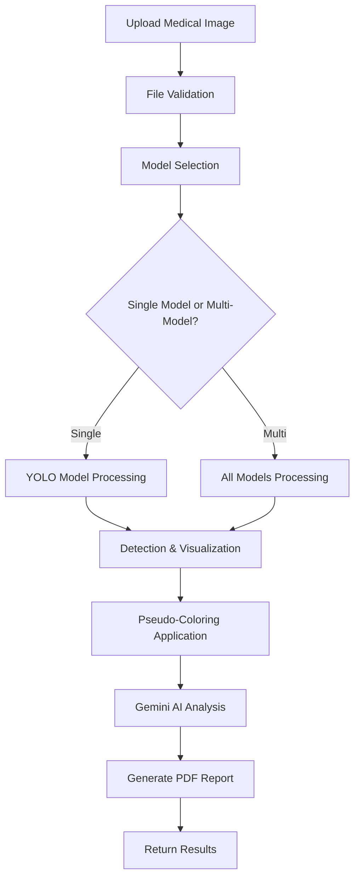
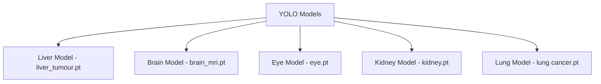

# MediCure-AI: Advanced Medical Image Analysis System


This project implements a cutting-edge AI-powered medical image analysis system that leverages multiple fine tuned  YOLO Nano segmentation model and Google's Gemini AI to detect various medical conditions from radiological images. The system provides real-time analysis, detailed reports, and professional medical insights for liver, brain, eye, kidney, and lung conditions.

## Table of Contents
- [Introduction](#introduction)
- [Features](#features)
- [Supported Medical Conditions](#supported-medical-conditions)
- [System Architecture](#system-architecture)
- [Installation](#installation)
- [Configuration](#configuration)
- [Usage](#usage)
- [API Endpoints](#api-endpoints)
- [Technologies Used](#technologies-used)
- [Code Structure](#code-structure)
- [Contributing](#contributing)
- [License](#license)

## Introduction

MediCure-AI revolutionizes medical imaging with AI-powered diagnostic precision. Our system combines state-of-the-art fine tuned  YOLO Nano segmentation model with Google's Gemini AI to provide comprehensive analysis of medical scans including CT, MRI, X-ray, and ultrasound images. The platform is designed to assist healthcare professionals in making faster, more accurate diagnoses while generating detailed PDF reports for clinical documentation.

## Features

- **Multi-Modal Medical Analysis**: Support for liver, brain MRI, eye, kidney, and lung imaging
- **Real-time Detection**: Instant analysis with confidence scoring and bounding box visualization
- **AI-Powered Insights**: Integration with Google Gemini AI for professional medical interpretations
- **Automated Report Generation**: PDF reports with findings, confidence scores, and treatment recommendations
- **Pseudo-Coloring**: Advanced visualization techniques for better anomaly identification
- **Web-Based Interface**: User-friendly Flask web application
- **Batch Processing**: Support for multiple model analysis on single images
- **Secure File Handling**: Robust file upload and processing with validation

## Supported Medical Conditions

### 🫀 Liver Analysis
- **Conditions Detected**: Liver tumors, normal liver tissue
- **Applications**: Hepatocellular carcinoma detection, liver health assessment

### 🧠 Brain MRI Analysis
- **Conditions Detected**: Brain tumors, anatomical structures
- **Applications**: Neurological disorder diagnosis, tumor detection

### 👁️ Eye Examination
- **Conditions Detected**: 
  - Cataract
  - Diabetic Retinopathy
  - Glaucoma
  - Normal eye conditions
- **Applications**: Ophthalmological screening, preventive care

### 🫘 Kidney Analysis
- **Conditions Detected**: Kidney stones
- **Applications**: Urological assessment, stone detection

### 🫁 Lung Analysis
- **Conditions Detected**: Lung tumors/cancer
- **Applications**: Pulmonary oncology, early cancer detection

## System Architecture

### Workflow Diagram

### Model Inventory

### Key Components
- **Image Upload & Validation**: Secure file handling with format verification
- **Multi-Model Detection**: Parallel processing across specialized YOLO models
- **Visualization Engine**: Bounding box rendering with pseudo-coloring for anomalies
- **AI Analysis**: Google Gemini integration for medical insights
- **Report Generation**: Automated PDF creation with comprehensive findings

## Installation

### Prerequisites
- Python 3.8 or later
- pip (Python package installer)
- CUDA-compatible GPU (recommended for faster inference)

### Step 1: Clone the Repository
```bash
git clone https://github.com/kknani24/medicure-ai-.git
cd medicure-ai-
```

### Step 2: Create Virtual Environment
```bash
python -m venv venv
source venv/bin/activate  # On Windows: venv\Scripts\activate
```

### Step 3: Install Required Packages
```bash
pip install -r requirements.txt
```

### Step 4: Install Additional Dependencies
```bash
# Install PyTorch with CUDA support (optional, for GPU acceleration)
pip install torch torchvision torchaudio --index-url https://download.pytorch.org/whl/cu118

# Install Ultralytics YOLO
pip install ultralytics

# Install additional packages
pip install flask opencv-python google-generativeai reportlab python-dotenv
```

## Configuration

### Step 1: Environment Setup
Create a `.env` file in the project root:
```env
GEMINI_API_KEY=your_google_gemini_api_key_here
```

### Step 2: Model Files
Ensure all YOLO model files are present:
```
├── liver_tumour.pt
├── brain_mri.pt
├── eye.pt
├── kidney.pt
└── lung cancer.pt
```

### Step 3: Directory Structure
```
medicure-ai-/
├── app.py
├── .env
├── requirements.txt
├── static/
│   └── uploads/
├── templates/
│   └── index.html
├── models/
│   ├── liver_tumour.pt
│   ├── brain_mri.pt
│   ├── eye.pt
│   ├── kidney.pt
│   └── lung cancer.pt
└── README.md
```

## Usage

### Step 1: Start the Application
```bash
python app.py
```

### Step 2: Access the Web Interface
Open your browser and navigate to `http://localhost:5000`

### Step 3: Upload and Analyze
1. Select a medical image (PNG, JPG, JPEG formats supported)
2. Choose a specific model or leave blank for multi-model analysis
3. Click "Analyze Image" to process
4. View results, AI insights, and download the PDF report

### Command Line Usage
For programmatic access, you can also use the API endpoints directly:

```python
import requests

# Upload and analyze image
files = {'file': open('medical_scan.jpg', 'rb')}
data = {'model': 'liver'}  # Optional: specify model
response = requests.post('http://localhost:5000/detect', files=files, data=data)
result = response.json()
```

## API Endpoints

### POST /detect
Analyzes uploaded medical images and returns detection results.

**Parameters:**
- `file` (required): Medical image file (PNG, JPG, JPEG)
- `model` (optional): Specific model to use ('liver', 'brain_mri', 'eye', 'kidney', 'lung')

**Response:**
```json
{
    "message": "Detection completed",
    "original_image": "/static/uploads/scan.jpg",
    "processed_image": "/static/uploads/processed_scan.jpg",
    "detections": {
        "liver": [
            {
                "class": "tumor",
                "confidence": 0.87,
                "bbox": [150, 200, 300, 350]
            }
        ]
    },
    "gemini_response": "AI medical analysis...",
    "pdf_report": "/static/uploads/report_scan.pdf"
}
```

## Technologies Used

### YOLO (You Only Look Once)


YOLO is a state-of-the-art real-time object detection system. In this project, we use specialized YOLO models trained on medical datasets for accurate detection of various pathological conditions. The models provide fast inference with high accuracy, making them ideal for clinical applications.

### Google Gemini AI


Google's Gemini AI provides advanced multimodal understanding capabilities. In our system, it analyzes medical images alongside detection results to generate professional medical insights, treatment recommendations, and diagnostic interpretations with the expertise of a seasoned clinician.

### Flask


Flask serves as the web framework powering our medical analysis platform. Its lightweight nature and extensive ecosystem make it perfect for creating responsive web applications that can handle medical image processing workflows efficiently.

### OpenCV


OpenCV handles all computer vision operations including image loading, processing, visualization, and pseudo-coloring. Its optimized algorithms ensure fast image manipulation and enhancement, crucial for real-time medical image analysis.


## Code Structure

```
medicure-ai/
├── app.py                     # Main Flask application
├── static/
│   ├── uploads/              # Uploaded and processed images
│   └── css/                  # Stylesheets
├── templates/
│   └── index.html            # Web interface template
├── models/                   # YOLO model files
├── requirements.txt          # Python dependencies
├── .env                      # Environment variables
└── README.md                # Project documentation
```

### Key Functions

- **`allowed_file()`**: Validates uploaded file formats
- **`process_image()`**: Main image processing pipeline
- **`process_multiple_model_results()`**: Handles multi-model analysis
- **`generate_response_with_image()`**: Interfaces with Gemini AI
- **`create_pdf_report()`**: Generates comprehensive PDF reports

## Contributing

We welcome contributions to improve MediCure-AI! Here's how you can contribute:

1. **Fork the Repository**
```bash
git fork https://github.com/kknani24/medicure-ai-.git
```

2. **Create a Feature Branch**
```bash
git checkout -b feature/amazing-feature
```

3. **Make Your Changes**
- Add new medical models
- Improve detection accuracy
- Enhance UI/UX
- Add new features

4. **Commit Your Changes**
```bash
git commit -m "Add amazing feature"
```

5. **Push to the Branch**
```bash
git push origin feature/amazing-feature
```

6. **Open a Pull Request**

### Areas for Contribution
- **Model Enhancement**: Improve existing models or add new medical condition detection
- **UI/UX Improvements**: Enhance the web interface and user experience
- **Performance Optimization**: Optimize inference speed and memory usage
- **Documentation**: Improve documentation and add tutorials
- **Testing**: Add comprehensive test coverage

## License

This project is licensed under the MIT License. See the [LICENSE](LICENSE) file for details.

---

## Disclaimer

⚠️ **Important Medical Disclaimer**: This AI system is designed to assist healthcare professionals and should not be used as a substitute for professional medical diagnosis or treatment. Always consult with qualified healthcare providers for medical decisions. The system is intended for educational and research purposes and should undergo proper clinical validation before use in medical practice.

---

**© 2025 MediCure-AI. All rights reserved.**

For questions, support, or collaboration opportunities, please open an issue or contact the development team.
